# Rotten-v-s-Fresh-Fruit-Detection
## To Classify fruits based on freshness factor

**Author** : SHAILESH DHAMA

Study and classify the fruits based on quality/freshness factor
                
### Dataset : https://www.kaggle.com/sriramr/fruits-fresh-and-rotten-for-classification

## Approach:

### Data processing & Exploratory Data Analysis:

    1.Import Libraries
    2.Loading and processing data
    3.Build our Convolutional Neural Network
    4.Show important plots
    5.Test our model
           
## RESULTS :

#### Data Exploration

##### Rotten Bananas
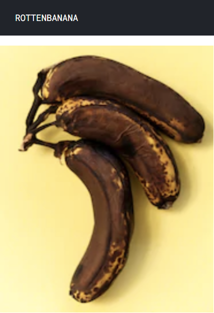
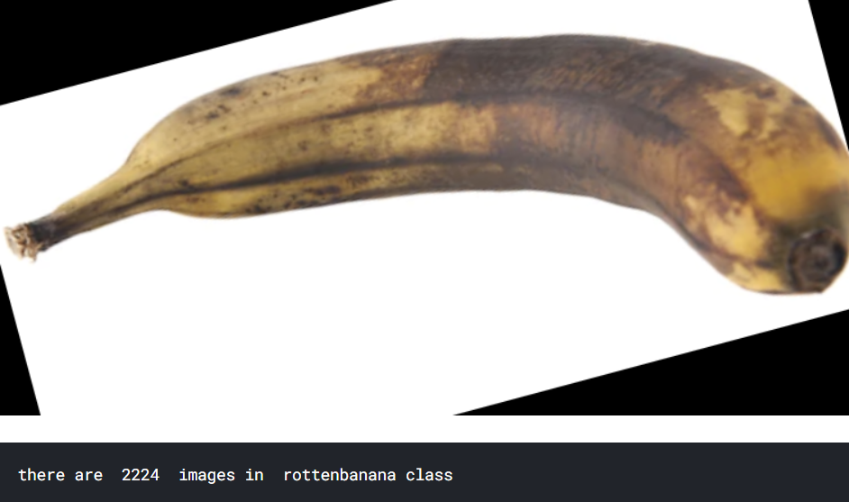

##### Fresh Oranges
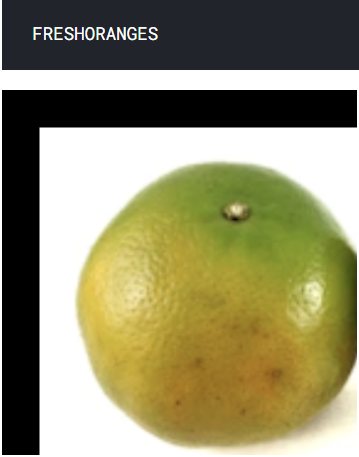
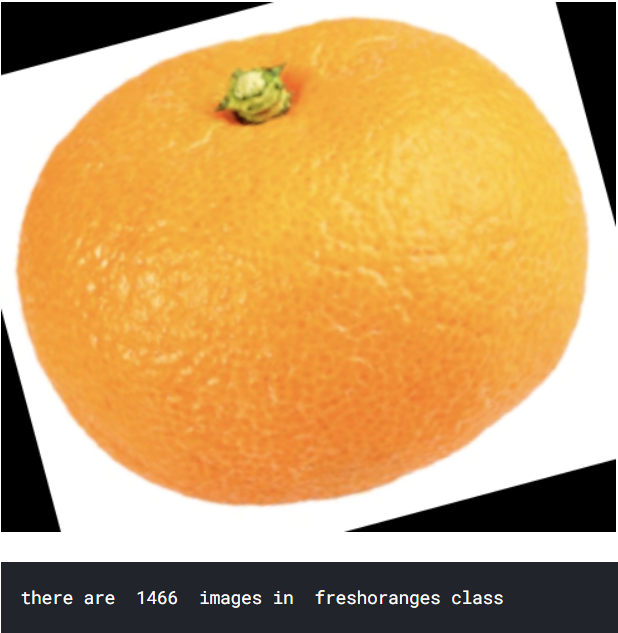

##### Rotten Oranges
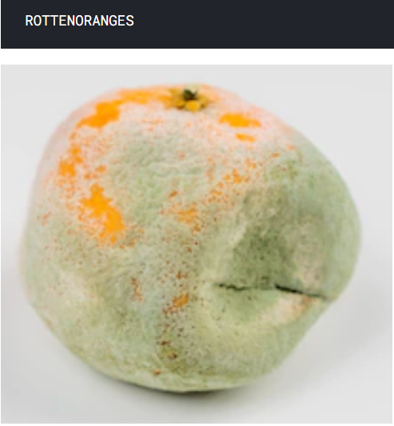
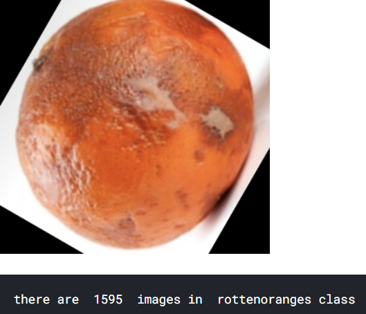

##### Fresh Bananas
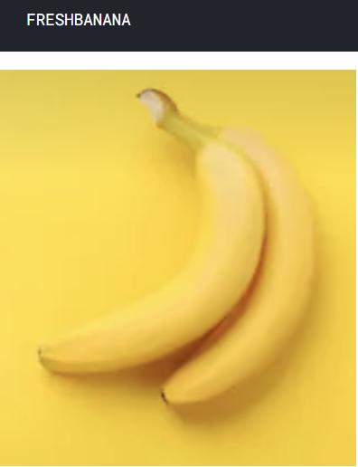
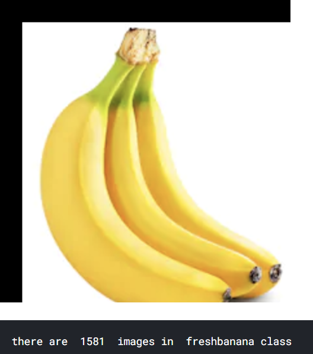

##### Rotten Apples
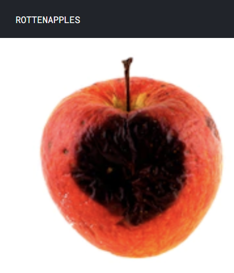
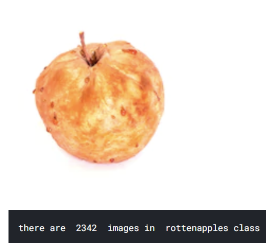

##### Fresh Apples
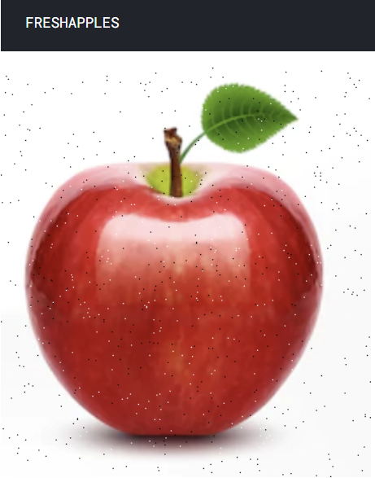
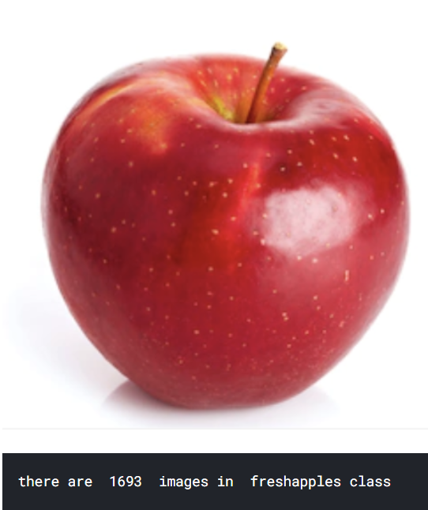

#### Convolutional Neural Network
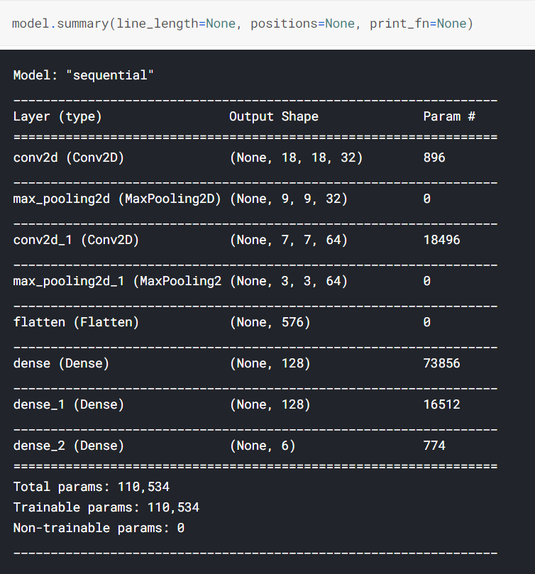

#### Model Training
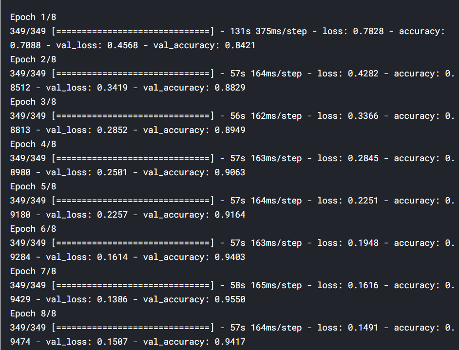

#### Accuracy over epochs plot
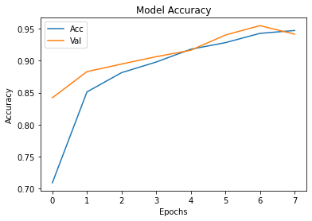

#### Loss over epochs plot
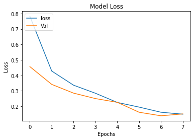

#### Prediction Results
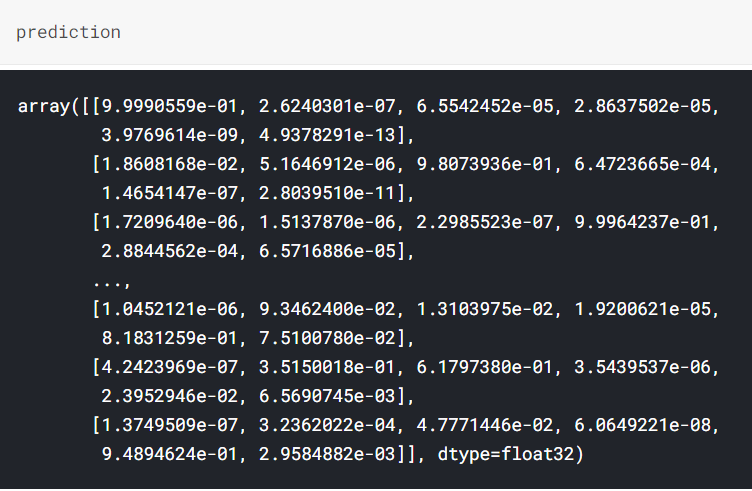

### For further information:

Please review the narrative of our analysis in [our jupyter notebook](./Rotten%20vs%20Fresh%20Fruit%20Detection.ipynb)

For any additional questions, please contact **shaileshettyd@gmail.com)

##### Repository Structure:

```
├── README.md                                                                                                   <- The top-level README for reviewers
├── Rotten%20vs%20Fresh%20Fruit%20Detection.ipynb                                                               <- narrative documentation of analysis
├── https://www.kaggle.com/sriramr/fruits-fresh-and-rotten-for-classification                                   <- Dataset
└── images                                                                                                      <- generated from code
```
## Citing :

```
@misc{Shailesh:2020,
  Author = {Shailesh Dhama},
  Title = {Rotten-v-s-Fresh-Fruit-Detection},
  Year = {2020},
  Publisher = {GitHub},
  Journal = {GitHub repository},
  Howpublished = {\url{https://github.com/ShaileshDhama/Rotten-v-s-Fresh-Fruit-Detection}}
}
```
